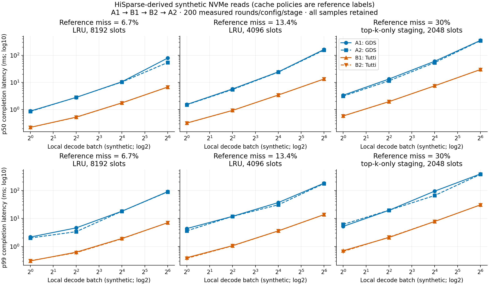
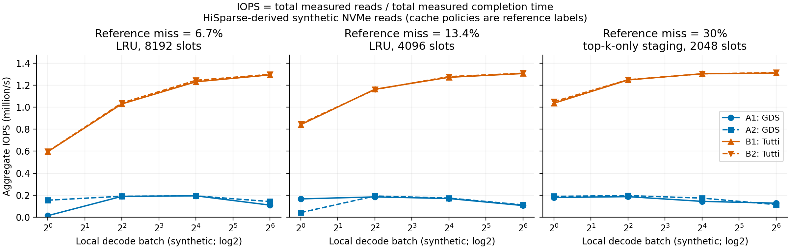

# HiSparse 参考参数：同盘 GDS / Tutti 重跑结果

12 个已测配置中，Tutti 的合并 p50 均低于 GDS，延迟加速比为 3.91–11.88×。
本轮 A1/B1/B2/A2 均重新测量，在一次 GPU 预约中顺序完成；未复用旧性能样本。
每阶段 12 配置 × 200 正式轮，共 9600 条正式样本；含预热和边界检查的 10176 轮全部校验成功。数据文件运行前后 SHA-256 一致。

## 主场景：参考 miss rate 13.4%

该参考均值对应 HiSparse 论文 GLM-5.1 locality trace 的 4096 槽 LRU；本实验只据此生成 SSD 读取数，没有运行真实 TopK 或 LRU。
`top_k=2048`，`n_reads=round(local_decode_batch×2048×reference_miss_rate)`。每次物理读取为 4 KiB。

| 本地 batch | 每轮读取数 | GDS p50 ms | Tutti p50 ms | p50 加速比 | p99 加速比 |
|---:|---:|---:|---:|---:|---:|
| 1 | 274 | 1.531 | 0.319 | 4.80× | 11.06× |
| 4 | 1098 | 5.618 | 0.934 | 6.01× | 11.13× |
| 16 | 4391 | 24.293 | 3.450 | 7.04× | 10.01× |
| 64 | 17564 | 159.541 | 13.427 | 11.88× | 13.13× |

每个表格单元来自同一后端两个阶段合并的 400 次测量。延迟加速比为 GDS/Tutti，属于描述性统计。

## 其余配置与图表

本地 batch 扫描 1/4/16/64；参考 miss rate 为 6.7%/13.4%/30%，对应参考标签 LRU 8192 槽、LRU 4096 槽、TopK-only staging 2048 槽。
cache/policy 标签用于说明论文中的参考场景，当前 SSD 微基准不实例化这些缓存。
[完整对比表](analysis/comparison.csv)包含全部 12 配置；[配置表](configuration-table.csv)另列物理读取字节数和取整后的有效比例。
[分阶段统计](analysis/phase-summary.csv)包含均值、p50/p95/p99/max、提交耗时、两种 IOPS 口径；[全部原始轮次](analysis/all-rounds.csv)保留预热和校验记录。

[延迟 PDF](analysis/phase-latency.pdf) · [IOPS PDF](analysis/phase-iops.pdf)

## 重复性与限制

- B2/B1 各配置 p50 比值为 0.989–0.999；Tutti 两阶段差异约在 1.2% 内。
- A2/A1 各配置 p50 比值为 0.686–1.005，GDS 部分配置有明显阶段漂移，最大下降约 31.4%。
- GDS 正式轮仍有极长停顿，最大约 1.702 s。全部保留；累计 IOPS 对这类停顿敏感，不把异常大的吞吐比当成典型延迟收益。[各阶段最慢轮](tail-observations.json)
- 参考 miss rate 是论文特定 trace 的平均值，本实验没有复现其逐层逐步的 miss 分布或访问局部性。
- 原始 HiSparse 从 CPU pinned DRAM 补入 GPU；这里假设一个逻辑 miss 对应一次 4 KiB SSD 读，没有模拟主机缓存命中或多个 KV 记录合并读取。
- 测量范围为一层一次 decode 的合成 IO；不包含模型计算，也不是端到端生成加速。
- 逻辑在途上限 256，16 个提交窗口，每窗口最多 16 IO；数据 HBM 256 MiB。GDS 使用 CUDA 12.8，Tutti 使用共享 CUDA 13。
- 四阶段虽连续执行，仍有驱动交接、独立初始化和固定配置顺序；该实验不能消除全部时间与系统状态影响。

## 路径与资源检查

- 同一 cb SSD：`0000:cb:00.0`，序列号 `PHCP418201G07P6CGN`；同一 GPU 0：`0000:4b:00.0`。
- 两次 GDS 的 compat 模式关闭、POSIX batch 计数为零；各有 1,156,884 次 BatchSubmit/BatchComplete，错误计数为零。Tutti 两阶段使用实际 GPU NVMe kernel 并核对租用设备。
- 数据 SHA-256：`6e412d41f9e2eb526febb789788ec73ea822d646e8891320a9dcc0ce63c3ab13`。
- GPU 预约已释放，实验挂载已卸载，cb 恢复初始未绑定状态。共享 daemon 及四个共享盘挂载保持运行。
- 原地复用共享构建和依赖，没有改动内核模块、共享库或数据文件。
[完整路径审计](phase-audit.json) · [操作记录](operations.json) · [最终环境检查](environment-after.json) · [分析口径](analysis/analysis.json)

## 参数依据

[HiSparse §4.3](https://arxiv.org/html/2608.07009v1#S4.SS3)提供参考均值；[§4.4](https://arxiv.org/html/2608.07009v1#S4.SS4)提供 kernel batch 尺度。
本地说明：[WORKLOAD_SEMANTICS.md](../../WORKLOAD_SEMANTICS.md)。运行输入快照：[profile.json](profile.json)；源模板的提议状态是生成输入时的状态，本轮完成状态以本报告和审计为准。
